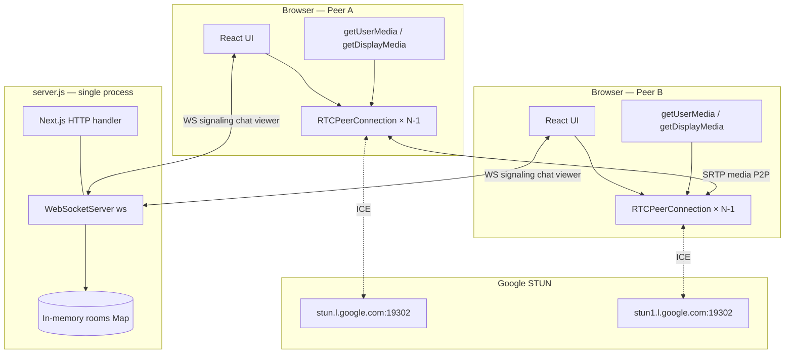
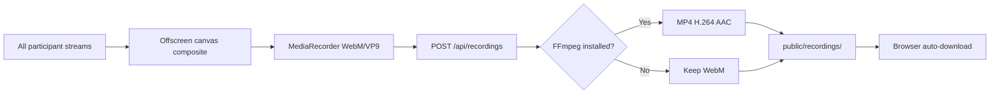
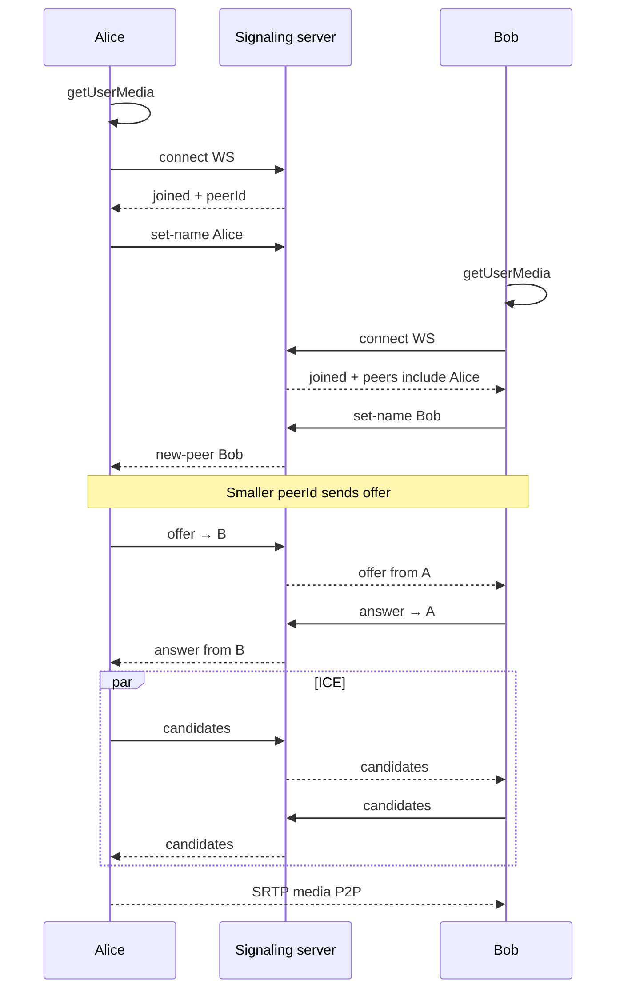
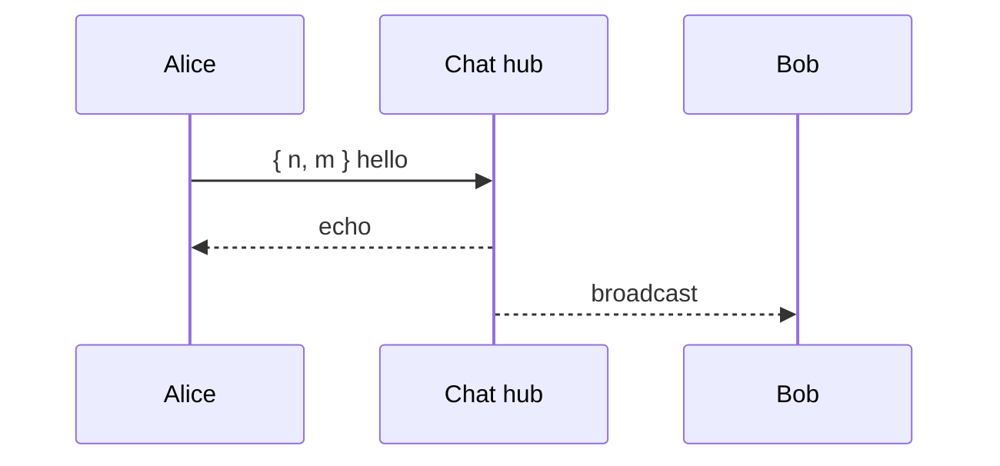
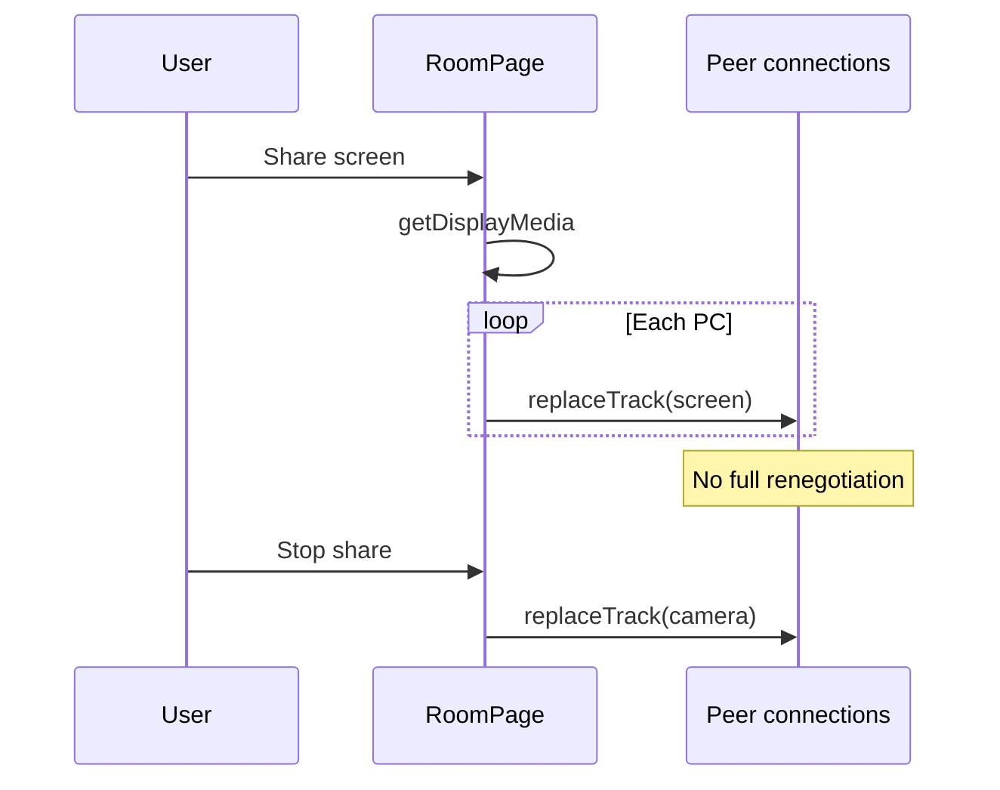

<div align="center">

# NexusRTC

**Real-time, peer-to-peer video conferencing — no sign-up, no accounts, one link to join.**

Built with **WebRTC mesh**, **Next.js 14**, **React 18**, and a custom **Node.js WebSocket** signaling server in a single process.

[](https://nextjs.org/)
[](https://react.dev/)
[](https://www.typescriptlang.org/)
[](https://webrtc.org/)
[](https://www.docker.com/)

[Features](#features) · [Quick Start](#quick-start) · [Architecture](#architecture) · [Protocol](#websocket-protocol-reference) · [Deploy](#production-deployment)

</div>

---

## Table of Contents

1. [What is NexusRTC?](#what-is-nexusrtc)
2. [Key Concepts (Read This First)](#key-concepts-read-this-first)
3. [Features](#features)
4. [Quick Start](#quick-start)
5. [User Journey (End-to-End)](#user-journey-end-to-end)
6. [Tech Stack](#tech-stack)
7. [Architecture](#architecture)
8. [Mesh Topology & Scaling](#mesh-topology--scaling)
9. [Project Structure (Every File Explained)](#project-structure-every-file-explained)
10. [HTTP Routes & Pages](#http-routes--pages)
11. [WebSocket Protocol Reference](#websocket-protocol-reference)
12. [WebRTC Implementation Details](#webrtc-implementation-details)
13. [Meeting Recording Pipeline](#meeting-recording-pipeline)
14. [Chat System](#chat-system)
15. [UI & Design System](#ui--design-system)
16. [State & Data Model](#state--data-model)
17. [Sequence Diagrams](#sequence-diagrams)
18. [Environment Variables](#environment-variables)
19. [npm Scripts](#npm-scripts)
20. [Docker](#docker)
21. [Production Deployment](#production-deployment)
22. [Reverse Proxy (Nginx / Caddy)](#reverse-proxy-nginx--caddy)
23. [Browser Support & Permissions](#browser-support--permissions)
24. [Troubleshooting](#troubleshooting)
25. [Security](#security)
26. [FAQ](#faq)
27. [Roadmap](#roadmap)
28. [Contributing](#contributing)
29. [License](#license)

---

## What is NexusRTC?

**NexusRTC** is an open-source browser video calling app. You open the site, click **Start a meeting**, get a unique room URL, share it with friends, and everyone joins with camera and microphone — **without creating an account**.

### What makes it different?

| Aspect | NexusRTC approach |
|--------|-------------------|
| **Media path** | **Peer-to-peer (mesh)** — video/audio goes directly between browsers after setup |
| **Server role** | **Signaling + chat + metadata only** — server never relays video |
| **Auth** | **None** — room UUID in the URL is the “password” |
| **Database** | **None** — all room state lives in memory on the Node process |
| **Deployment** | **Single long-running Node process** (not serverless) |

### What the server does vs what it does not

| Server **does** | Server **does not** |
|-----------------|---------------------|
| Serve Next.js UI (HTML/JS/CSS) | Transcode or relay video streams |
| Relay WebRTC SDP offers/answers/ICE | Store chat history permanently |
| Broadcast chat messages to room members | Authenticate users |
| Push live participant count every 1s | Scale horizontally without extra work |

---

## Key Concepts (Read This First)

### 1. Signaling vs media

- **Signaling** = small JSON messages over **WebSocket** (who joined, SDP, ICE candidates).
- **Media** = encrypted **SRTP** between peers after WebRTC connects.
- Confusing the two is the #1 mistake when debugging “chat works but video doesn’t.”

### 2. Mesh topology

If **4 people** are in a room, **each browser** maintains **3** `RTCPeerConnection`s (one per other person). Total connections in the room = **N × (N − 1) / 2** = 6.

**Sweet spot:** 4–6 participants. Beyond that, CPU and upload bandwidth on each client grow quickly.

### 3. STUN vs TURN

- **STUN** (included): helps discover public IP through NAT — works for many home networks.
- **TURN** (not included): relays media when P2P fails (corporate firewalls, symmetric NAT). You must add your own TURN server for hard networks.

### 4. Room URL = secret

Anyone with `https://yoursite.com/room/<uuid>` can join. Use long random UUIDs (crypto-safe) — the app does this automatically via `/room/create`.

---

## Features

### Video & audio

- Multi-peer video calls (full mesh).
- **1280×720 @ 30fps** camera capture (configurable in code).
- Echo cancellation on microphone.
- Mute/unmute mic and camera from bottom control dock.
- Local preview mirrored (self-view); remote peers not mirrored.
- Dynamic video grid layout (1–6+ participants).

### Screen sharing

- `getDisplayMedia` up to **1920×1080 @ 30fps**.
- Uses `RTCRtpSender.replaceTrack()` — **no full renegotiation** for most peers.
- Auto-stops when user ends share from browser UI (`track.onended`).
- Retries `replaceTrack` at 500ms and 2000ms if sender not ready.

### Meeting recording

- Records **entire meeting** as one composited frame (gallery-style layout).
- Client: offscreen `<canvas>` + `MediaRecorder` (VP9/WebM preferred).
- Uploads to `POST /api/recordings`.
- Server: optional **FFmpeg** transcode to H.264/AAC MP4 (Docker image includes FFmpeg).
- Auto-download in browser when recording stops.
- **“X is recording”** banner synced to all peers via signaling.

### Chat

- Dedicated WebSocket per room (separate from signaling).
- Text messages, **typing indicators** (500ms debounce, 3s auto-clear).
- Emoji picker.
- Image paste/drag/upload as **base64 data URLs**.
- Unread dot when panel collapsed.

### UX

- Modern **landing page** (hero, features, how-it-works, CTA).
- **Room page** with glass nav, room ID pill, live “in call” count, empty-state panel, floating controls.
- **Dark / light theme** — system preference + `localStorage`.
- Name modal before join; name stored in `localStorage`.
- One-click **Copy link**.

### Technical

- Google public **STUN** servers.
- ICE candidate **queue** until `setRemoteDescription`.
- **“Lowest peer ID offers”** rule to avoid glare (both sides sending offers).
- WebSocket **auto-reconnect** (~1s) on signaling drop.
- Single `server.js` entry: HTTP + WebSocket on one port.

---

## Quick Start

### Prerequisites

| Requirement | Version / notes |
|-------------|-----------------|
| **Node.js** | 18+ (Docker uses 20 Alpine) |
| **npm** | Comes with Node |
| **Browser** | Chrome 90+, Firefox 88+, Safari 14+, Edge 90+ |
| **FFmpeg** | Optional locally; included in Docker for recording MP4 |

### Install & run (development)

```bash
# Clone
git clone https://github.com/subhm2004/NexusRTC.git
cd NexusRTC

# Install dependencies (--legacy-peer-deps required for Next 14 / React 18)
npm install --legacy-peer-deps

# Start dev server (Next.js HMR + WebSockets on same port)
npm run dev
```

Wait until you see:

```text
> Ready on http://localhost:3000
```

> **Note:** The **first** compile after install can take **1–3 minutes**. Later restarts are faster.

Open **http://localhost:3000** → **Start a meeting** → allow camera/mic → share the room URL in a second tab/device to test.

### Port already in use?

```bash
# macOS / Linux — find and kill process on 3000
lsof -i :3000
kill <PID>

# Or use another port
PORT=3001 npm run dev
```

---

## User Journey (End-to-End)

```text
1. User visits /
   └── Landing page: marketing, features, "Start a meeting"

2. User clicks "Start a meeting" → /room/create
   └── Server generates crypto.randomUUID() → redirect to /room/<uuid>

3. /room/<uuid> loads RoomPage
   └── Name modal (if no name in localStorage)
   └── User enters display name → saved to localStorage

4. Browser requests getUserMedia (camera + mic)
   └── On deny: permission banner shown

5. Signaling WebSocket opens: /room/<uuid>/websocket
   └── Server sends { event: "joined", peerId, peers[] }
   └── Client sends { event: "set-name", name }
   └── Server notifies others: { event: "new-peer", ... }

6. WebRTC handshake (per peer pair)
   └── Lower peerId creates offer → answer → ICE trickle
   └── Media flows P2P (SRTP)

7. Parallel connections
   └── Chat WS: /room/<uuid>/chat/websocket
   └── Viewer count WS: /room/<uuid>/viewer/websocket (count every 1s)

8. User leaves → WS close → peer-left broadcast → others close RTCPeerConnection
```

---

## Tech Stack

| Layer | Technology | Purpose |
|-------|------------|---------|
| **UI** | Next.js 14 App Router, React 18, TypeScript 5 | Pages, components, API routes |
| **Styling** | Plain CSS + CSS variables | Themes, landing, room UI — no Tailwind |
| **Runtime** | Node.js | Custom HTTP server |
| **Realtime** | `ws` package | WebSocket signaling, chat, viewer count |
| **Media** | WebRTC APIs | P2P audio/video/screen |
| **NAT** | Google STUN | ICE candidate gathering |
| **Recording** | MediaRecorder + Canvas + FFmpeg (optional) | Client capture, server transcode |
| **Deploy** | Docker Compose, Node 20 Alpine | Production image with FFmpeg |

### Dependencies (`package.json`)

| Package | Version | Role |
|---------|---------|------|
| `next` | 14.2.18 | React framework, build, API routes |
| `react` / `react-dom` | ^18.3 | UI |
| `ws` | ^8.18 | WebSocket server |
| `typescript` | ^5 | Type checking (dev) |

---

## Architecture

### High-level diagram



### Process model

```text
node server.js
├── next({ dev | production })
├── http.createServer → app.getRequestHandler()  // all HTTP (pages, /api/*, static)
├── WebSocketServer { noServer: true }
└── server.on('upgrade') → route by pathname
```

**Important:** You cannot deploy on **Vercel serverless** alone — WebSockets need a persistent Node process.

---

## Mesh Topology & Scaling

### Connection count

| Peers (N) | Connections per peer | Total connections in room |
|-----------|----------------------|---------------------------|
| 2 | 1 | 1 |
| 3 | 2 | 3 |
| 4 | 3 | 6 |
| 5 | 4 | 10 |
| 6 | 5 | 15 |

### Bandwidth (rough estimate)

Each peer **sends** one upstream per remote viewer (mesh). For 720p30, plan **~1–3 Mbps upload per remote peer** depending on codec/congestion. At 5 peers, one user might need **4× upload** — fine on fiber, painful on weak Wi‑Fi.

### When to move to SFU

Consider **mediasoup**, **LiveKit**, or **Janus** when you need:

- 8+ participants reliably
- Server-side recording without client composite
- Simulcast / adaptive bitrate per subscriber

---

## Project Structure (Every File Explained)

```text
NexusRTC/
├── server.js                    # ENTRYPOINT — HTTP + WebSocket upgrade routing
├── lib/
│   └── room-state.js            # In-memory room registry, chat broadcast, viewer tick
├── src/
│   ├── app/
│   │   ├── layout.tsx           # Root HTML, fonts (Plus Jakarta Sans), ThemeProvider
│   │   ├── page.tsx             # Landing page (hero, features, steps, CTA)
│   │   ├── globals.css          # Design tokens, landing + room + chat + video styles
│   │   ├── api/
│   │   │   └── recordings/
│   │   │       └── route.ts     # POST upload WebM → optional FFmpeg → MP4
│   │   └── room/
│   │       ├── create/
│   │       │   └── page.tsx     # redirect(/room/${randomUUID()})
│   │       └── [uuid]/
│   │           └── page.tsx     # Server: build roomLink, render <RoomPage />
│   └── components/
│       ├── RoomPage.tsx         # ~1200 lines — WebRTC, signaling, recording, UI
│       ├── Chat.tsx             # Chat WebSocket client
│       ├── StreamPage.tsx       # Viewer-oriented variant (partial / legacy stream API)
│       ├── ThemeProvider.tsx    # Applies data-theme on <html>
│       └── ThemeToggle.tsx      # Dark/light toggle button
├── public/
│   └── recordings/              # Saved meeting files (gitignored in practice)
├── Dockerfile                   # node:20-alpine + ffmpeg + npm run build
├── docker-compose.yml           # Single service on port 3000
├── next.config.js               # reactStrictMode: true
├── tsconfig.json                # Path alias @/* → src/*
├── package.json
└── README.md
```

### `server.js` (detailed)

| Responsibility | Detail |
|----------------|--------|
| Boot Next.js | `next({ dev, hostname, port })` then `app.prepare()` |
| HTTP | Delegates to Next handler for all non-WS requests |
| WS upgrade | Parses pathname; destroys socket if no match |
| Room signaling | Creates `peerId` (UUID), handles `set-name`, relays offer/answer/candidate |
| Recording sync | `recording-started` / `recording-stopped` broadcast |
| Chat | Adds socket to `room.hub.clients`, broadcasts raw messages |
| Viewer | Adds socket to `room.viewerSockets`, pushes count on interval |

### `lib/room-state.js` (detailed)

| Export | Purpose |
|--------|---------|
| `getOrCreateRoom(uuid)` | Creates `{ peers, hub, viewerSockets }` if missing |
| `getRoomByUuid(uuid)` | Returns room or null |
| `broadcastChat(hub, message)` | Sends string to all chat clients in room |
| `startViewerCountInterval()` | Every **1000ms**, sends `room.peers.size` to viewer sockets |
| `rooms` / `streams` | Internal Maps (also `sha256` stream index for future stream URLs) |

**Room object shape:**

```js
{
  peers: Map<peerId, { ws, name, isViewer }>,
  hub: { clients: Set<WebSocket> },
  viewerSockets: Set<WebSocket>,
  recordingPeer: { peerId, name } | null  // set at runtime by server.js
}
```

### `src/components/RoomPage.tsx` (detailed)

| Area | Lines / concepts |
|------|------------------|
| `RemoteVideo` | Binds `MediaStream` to `<video>`, handles `addtrack`/`removetrack` |
| `createMeetingCompositeStream` | Canvas grid + mixed audio for recording |
| `NameInputModal` | Pre-join name gate |
| `ICE` config | STUN servers (add TURN here) |
| `createOfferTo` | Mesh offer side + `ontrack` stream merging |
| Signaling `useEffect` | WS message switch: joined, new-peer, offer, answer, candidate, peer-left |
| Media | `getUserMedia`, screen share, `replaceTrack` |
| Recording | MediaRecorder → FormData → `/api/recordings` |

### `src/components/Chat.tsx`

| Feature | Implementation |
|---------|----------------|
| Connect | `new WebSocket(wsUrl)` when `wsUrl` set |
| Send text | `{ n, m }` JSON |
| Typing | `{ type: "typing", n }` debounced 500ms |
| Images | `{ type: "image", n, url }` base64 |
| Name edit | Click “You: name” in header → inline input |

---

## HTTP Routes & Pages

| Route | Type | Description |
|-------|------|-------------|
| `/` | Static page | Landing / marketing |
| `/room/create` | Server redirect | `randomUUID()` → `/room/<uuid>` |
| `/room/[uuid]` | Dynamic page | Video room (`RoomPage`) |
| `POST /api/recordings` | API | Upload recording blob |
| `GET /recordings/<file>` | Static | Files in `public/recordings/` |

### `POST /api/recordings`

**Request:** `multipart/form-data`

| Field | Type | Required | Description |
|-------|------|----------|-------------|
| `file` | Blob/File | Yes | WebM recording from browser |
| `roomId` | string | No | Used in filename sanitization |

**Response (success, FFmpeg OK):**

```json
{
  "url": "/recordings/recorded-meeting-<room>-<timestamp>.mp4",
  "filename": "recorded-meeting-....mp4",
  "compressed": true,
  "message": "Recording saved and compressed successfully"
}
```

**Response (FFmpeg missing/failed):**

```json
{
  "url": "/recordings/recorded-meeting-<room>-<timestamp>.webm",
  "compressed": false,
  "message": "Recording saved (FFmpeg unavailable or failed, using original)"
}
```

**FFmpeg args used:** `libx264`, `crf 23`, `preset fast`, `aac 128k`, `+faststart`.

---

## WebSocket Protocol Reference

All WebSockets use the **same host and port** as the website. Use `wss://` when the site is served over HTTPS.

### Endpoints (per room `uuid`)

| Path | Direction | Purpose |
|------|-----------|---------|
| `/room/:uuid/websocket` | Bidirectional | WebRTC signaling + room events |
| `/room/:uuid/chat/websocket` | Bidirectional | Chat fan-out |
| `/room/:uuid/viewer/websocket` | Server → client | Participant count (string integer) every ~1s |

### Signaling — client → server

```jsonc
// REQUIRED after connect — before others see you in the room
{ "event": "set-name", "name": "Alice" }

// WebRTC relay (server forwards to peer `to`)
{ "to": "<peerId>", "event": "offer",     "data": "<JSON string of RTCSessionDescription>" }
{ "to": "<peerId>", "event": "answer",    "data": "<JSON string of RTCSessionDescription>" }
{ "to": "<peerId>", "event": "candidate", "data": "<JSON string of RTCIceCandidate>" }

// Recording awareness
{ "event": "recording-started", "name": "Alice" }
{ "event": "recording-stopped" }
```

### Signaling — server → client

```jsonc
// On connect
{
  "event": "joined",
  "peerId": "<your-uuid>",
  "peers": [{ "id": "...", "name": "Bob" }],
  "viewer": false,
  "recordingPeer": { "peerId": "...", "name": "..." } | null
}

// After another peer sets name (first time)
{ "event": "new-peer", "peerId": "...", "name": "Carol", "viewer": false }

// Name change (after initial set-name)
{ "event": "peer-name-updated", "peerId": "...", "name": "Carol Updated" }

// Relayed WebRTC
{ "event": "offer" | "answer" | "candidate", "from": "<peerId>", "data": "..." }

// Peer disconnect
{ "event": "peer-left", "peerId": "..." }

// Recording
{ "event": "recording-started", "peerId": "...", "name": "Alice" }
{ "event": "recording-stopped", "peerId": "..." }
```

### Chat — client → server (broadcast to all in room)

```jsonc
// Text
{ "n": "Alice", "m": "Hello everyone!" }

// Typing indicator
{ "type": "typing", "n": "Alice" }

// Image (base64 data URL — keep images small)
{ "type": "image", "n": "Alice", "url": "data:image/png;base64,..." }
```

### Viewer WebSocket

- Server sends plain text: `"1"`, `"2"`, … = number of peers in `room.peers` Map.
- Updated every **1000ms** via `startViewerCountInterval()`.

---

## WebRTC Implementation Details

### ICE servers (default)

```typescript
// src/components/RoomPage.tsx
const ICE = {
  iceServers: [
    { urls: "stun:stun.l.google.com:19302" },
    { urls: "stun1.l.google.com:19302" },
  ],
};
```

### Media constraints (default)

```typescript
getUserMedia({
  video: { width: { max: 1280 }, height: { max: 720 }, frameRate: 30 },
  audio: { echoCancellation: true },
});
```

### Offer/answer glare avoidance

When peer B joins, both sides compare IDs:

- If `myId < peerId` → **I am offerer** (`createOffer`).
- Else → **I wait for offer** and respond with `answer`.

This prevents duplicate offers crashing negotiation.

### ICE candidate queue

If `addIceCandidate` arrives before `setRemoteDescription`, candidates are stored in `candidateQueueRef` per peer and flushed after remote description is set.

### Screen share

1. `getDisplayMedia({ video: { width: 1920, height: 1080 }, audio: false })`
2. For each `RTCPeerConnection`, find video `RTCRtpSender` → `replaceTrack(screenTrack)`
3. On `track.onended` → restore camera track

### Reconnection

Signaling WebSocket reconnects after close (~1s). Full page refresh may be needed if state is inconsistent after long disconnect.

---

## Meeting Recording Pipeline



| Step | Detail |
|------|--------|
| Composite | 1280×720 canvas; grid layout by participant count |
| Audio | Mixed via `AudioContext` + `MediaStreamDestination` |
| Codec | `video/webm;codecs=vp9` preferred, fallback `video/webm` |
| Upload | `FormData`: `file`, `roomId` |
| Notify peers | `recording-started` / `recording-stopped` on signaling WS |

---

## Chat System

| Constant | Value |
|----------|-------|
| `CHAT_NAME_KEY` | `nexus-chat-name` (localStorage) |
| Typing debounce | 500ms |
| Typing display timeout | 3000ms |

Chat is **not end-to-end encrypted**. Messages are visible to the server process and all clients in the room. Use **HTTPS** in production so transport is encrypted.

---

## UI & Design System

### Themes

- Attribute: `data-theme="dark"` | `data-theme="light"` on `<html>`
- Storage key: `nexus-theme`
- Font: **Plus Jakarta Sans** (Google Fonts)

### CSS variables (excerpt)

| Token | Purpose |
|-------|---------|
| `--bg`, `--bg-elevated` | Surfaces |
| `--accent` | Amber primary CTA |
| `--accent-secondary`, `--accent-violet` | Gradients |
| `--text`, `--text-muted` | Typography |
| `--radius`, `--radius-lg`, `--radius-full` | Corners |

### Pages

| Page | Classes | Notes |
|------|---------|-------|
| Landing | `.landing`, `.landing-hero`, … | Marketing layout |
| Room | `.room-page`, `.room-nav`, `.room-stage`, `.room-controls-dock` | Call UI |
| Modal | `.name-modal-room` | Join gate |

### Room UI layout

```text
┌─────────────────────────────────────────────────────────┐
│ room-nav: Logo | Room ID | N in call | Copy | Theme | Leave │
├─────────────────────────────────────────────────────────┤
│ room-stage                                              │
│  ┌──────────────────────┐  ┌─────────────────────┐   │
│  │ video-grid (tiles)   │  │ room-empty-panel    │   │
│  │                      │  │ (when alone)        │   │
│  └──────────────────────┘  └─────────────────────┘   │
├─────────────────────────────────────────────────────────┤
│         [ Mic ] [ Cam ] [ Share ] [ Rec ]  Name         │  ← fixed dock
│                                    [ Chat panel ]      │
└─────────────────────────────────────────────────────────┘
```

---

## State & Data Model

### Server memory (volatile)

- Lost on process restart.
- Not shared across multiple Node instances.
- Rooms never auto-expire (grow until process restart — consider TTL for production).

### Client (`RoomPage`)

| State / ref | Purpose |
|-------------|---------|
| `userName` | Display name |
| `remoteStreams` | `peerId → MediaStream` for tiles |
| `peerNames` | `peerId → string` |
| `peersRef` | `peerId → RTCPeerConnection` |
| `candidateQueueRef` | Pending ICE per peer |
| `localStreamRef` / `screenStreamRef` | Media sources |
| `wsRef` | Signaling WebSocket |

### localStorage keys

| Key | Used by |
|-----|---------|
| `nexus-theme` | ThemeToggle |
| `nexus-chat-name` | RoomPage name modal + Chat |

---

## Sequence Diagrams

### Room join + WebRTC handshake



### Chat message flow



### Screen share (replaceTrack)



---

## Environment Variables

| Variable | Default | Description |
|----------|---------|-------------|
| `PORT` | `3000` | HTTP + WebSocket listen port |
| `NODE_ENV` | `development` | `production` for optimized Next build |

Example:

```bash
PORT=8080 NODE_ENV=production npm start
```

---

## npm Scripts

| Script | Command | Description |
|--------|---------|-------------|
| `dev` | `node server.js` | Development (Next dev mode) |
| `build` | `next build` | Production bundle to `.next/` |
| `start` | `NODE_ENV=production node server.js` | Production server |
| `lint` | `next lint` | ESLint |
| `clean` | `rm -rf .next` | Clear Next cache |
| `reinstall` | wipe + `npm install --legacy-peer-deps` | Full reset |

### Production build locally

```bash
npm run build
npm start
```

---

## Docker

### Docker Compose (recommended)

```bash
docker compose up --build        # foreground
docker compose up -d --build     # detached
docker compose down
```

### Dockerfile highlights

- Base: `node:20-alpine`
- Installs **FFmpeg** for recording compression
- Runs `npm run build` then `CMD ["node", "server.js"]`
- Exposes port **3000**

### Plain Docker

```bash
docker build -t nexus-rtc .
docker run -p 3000:3000 nexus-rtc
```

---

## Production Deployment

### Supported platforms

| Platform | Works? | Notes |
|----------|--------|-------|
| VPS / EC2 / Droplet | ✅ | Best control; Nginx + TLS |
| Railway / Render / Fly.io | ✅ | Deploy Docker image; enable WebSockets |
| DigitalOcean App Platform | ✅ | Enable WebSocket health checks |
| Heroku (container) | ✅ | Single dyno; no horizontal scale without backplane |
| **Vercel serverless** | ❌ | No persistent WebSocket server |

### Single-instance rule

**Do not run multiple replicas** without Redis/NATS pub-sub for signaling. Room state is in-process memory — peers in the same room must hit the **same** Node instance.

### Production checklist

- [ ] **HTTPS** (required for camera/mic off localhost)
- [ ] `NODE_ENV=production`
- [ ] Reverse proxy forwards `Upgrade` + `Connection` headers
- [ ] WebSocket read timeout ≥ 3600s (long calls)
- [ ] Optional: **TURN** server for corporate users
- [ ] Optional: rate limits + max peers per room
- [ ] Optional: cron to prune `public/recordings/`

---

## Reverse Proxy (Nginx / Caddy)

### Nginx

```nginx
upstream nexus {
  server 127.0.0.1:3000;
}

server {
  listen 443 ssl http2;
  server_name calls.example.com;

  ssl_certificate     /path/to/fullchain.pem;
  ssl_certificate_key /path/to/privkey.pem;

  location / {
    proxy_pass http://nexus;
    proxy_http_version 1.1;
    proxy_set_header Host $host;
    proxy_set_header X-Forwarded-For $proxy_add_x_forwarded_for;
    proxy_set_header X-Forwarded-Proto $scheme;
    proxy_set_header Upgrade $http_upgrade;
    proxy_set_header Connection "upgrade";
    proxy_read_timeout 3600s;
    proxy_send_timeout 3600s;
  }
}
```

`X-Forwarded-Proto` is used in `room/[uuid]/page.tsx` to build correct `roomLink` for sharing.

### Caddy

```caddy
calls.example.com {
  reverse_proxy localhost:3000
}
```

---

## Browser Support & Permissions

| Browser | Min version | Notes |
|---------|-------------|-------|
| Chrome / Edge | 90+ | Recommended |
| Firefox | 88+ | Full support |
| Safari | 14+ | iOS: one camera tab at a time |
| Opera | 76+ | Chromium-based |

| Permission | API | When |
|------------|-----|------|
| Camera + mic | `getUserMedia` | On room join |
| Screen | `getDisplayMedia` | User clicks Share |

---

## Troubleshooting

| Symptom | Cause | Fix |
|---------|-------|-----|
| `EADDRINUSE` port 3000 | Old `node server.js` still running | `lsof -i :3000` → `kill <PID>` |
| Stuck on “Compiling / …” | First Next.js compile slow | Wait 2–3 min; or `npm run clean && npm run dev` |
| Permission denied camera | HTTP on non-localhost | Use HTTPS or localhost |
| See self, not remote | ICE failed or signaling down | Check WS in DevTools; add TURN |
| Chat works, no video | Signaling WS blocked separately | Fix proxy/firewall for `/room/*/websocket` |
| Screen share not visible | PC not `connected` yet | Wait; retries at 500ms/2000ms |
| Recording stays WebM | FFmpeg not installed | Install FFmpeg or use Docker image |
| Build fails on `.nft.json` | Corrupt `.next` cache | `npm run clean && npm run build` |

### Add TURN server

Edit `ICE` in `src/components/RoomPage.tsx`:

```typescript
const ICE = {
  iceServers: [
    { urls: "stun:stun.l.google.com:19302" },
    {
      urls: "turn:turn.example.com:3478",
      username: "user",
      credential: "pass",
    },
  ],
};
```

---

## Security

| Topic | Status |
|-------|--------|
| Authentication | **None** — URL secrecy only |
| Media encryption | **SRTP** between peers (WebRTC default) |
| Signaling | Plain JSON over WS — use **WSS** in production |
| Chat | **Not E2E** — server can read messages |
| Names | User-chosen, not verified |
| Recordings | Saved on server disk under `public/recordings/` |
| Chat images | Base64 inline — risk of large payloads; add size limits |
| DoS | Unbounded rooms/peers in memory — add limits for public deploy |

---

## FAQ

**Q: Do I need to create an account?**  
A: No. Share the room link and anyone with it can join.

**Q: Does video go through your server?**  
A: No. After signaling, media flows directly between browsers (WebRTC mesh). The server only relays SDP and ICE messages.

**Q: How many people can join one room?**  
A: There is no hard cap in code, but mesh works best with **4–6** participants. Larger groups need an SFU architecture.

**Q: Does it work on mobile?**  
A: Yes on modern mobile browsers. iOS Safari has extra limits (e.g. one camera tab at a time, background tabs may pause media).

**Q: Where are recordings stored?**  
A: On the server under `public/recordings/` after upload. Lock down or remove this directory in production if you do not want public file access.

**Q: Can I deploy on Vercel?**  
A: Not as serverless-only. You need the full `server.js` process (VPS, Docker, Railway, Render, Fly.io, etc.) for WebSockets.

**Q: Do room links expire?**  
A: No automatic expiry. A room exists in memory while the server is running and peers may still be connected. Restarting the server clears all rooms.

---

## Roadmap

- [ ] TURN (`coturn`) in `docker-compose.yml`
- [ ] Room passwords / join tokens
- [ ] SFU mode for 8+ participants
- [ ] Persistent chat (Redis/SQLite + TTL)
- [ ] Server-side recording (headless Chromium)
- [ ] PWA install prompts
- [ ] Virtual backgrounds (MediaPipe)
- [ ] E2E encrypted chat

---

## Contributing

The codebase is small enough to understand in one session. Start with:

1. `server.js` — WebSocket routing  
2. `lib/room-state.js` — room memory  
3. `src/components/RoomPage.tsx` — WebRTC client  

```bash
git checkout -b feat/your-feature
# edit
npm run lint
git commit -m "feat: describe your change"
```

Open a PR with description + screenshots or screen recording.

---

## License

Open source — use, fork, and adapt freely. A GitHub star is appreciated if you ship something built on NexusRTC.

---

<div align="center">

**Built with Next.js · React · WebRTC · Node.js**

[Report issues](https://github.com/subhm2004/NexusRTC/issues) · [Star on GitHub](https://github.com/subhm2004/NexusRTC)

</div>
