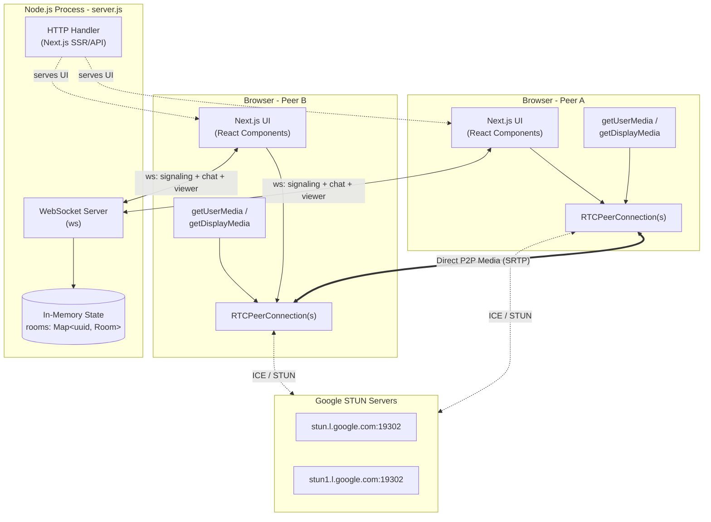
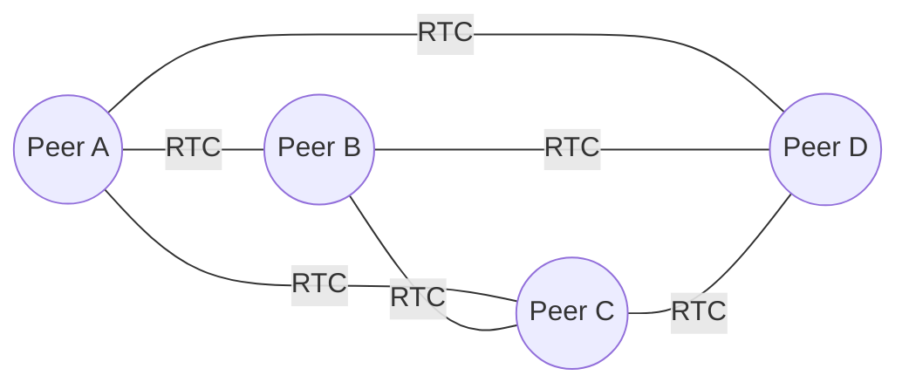
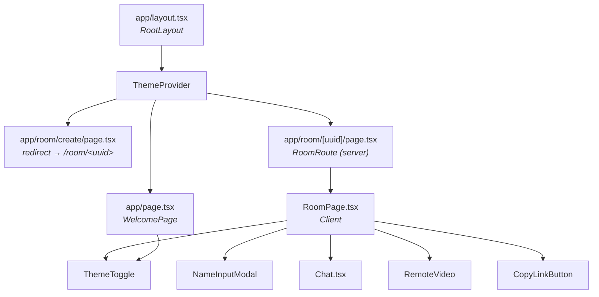
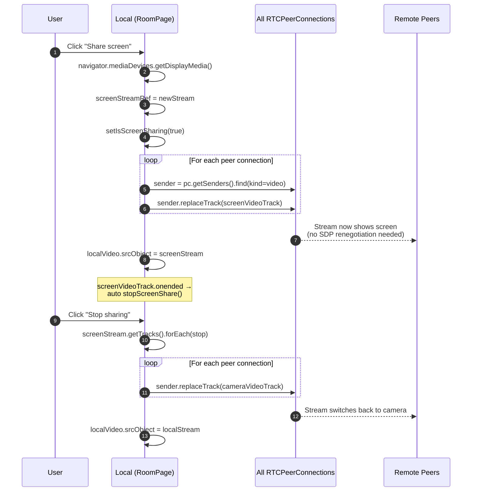
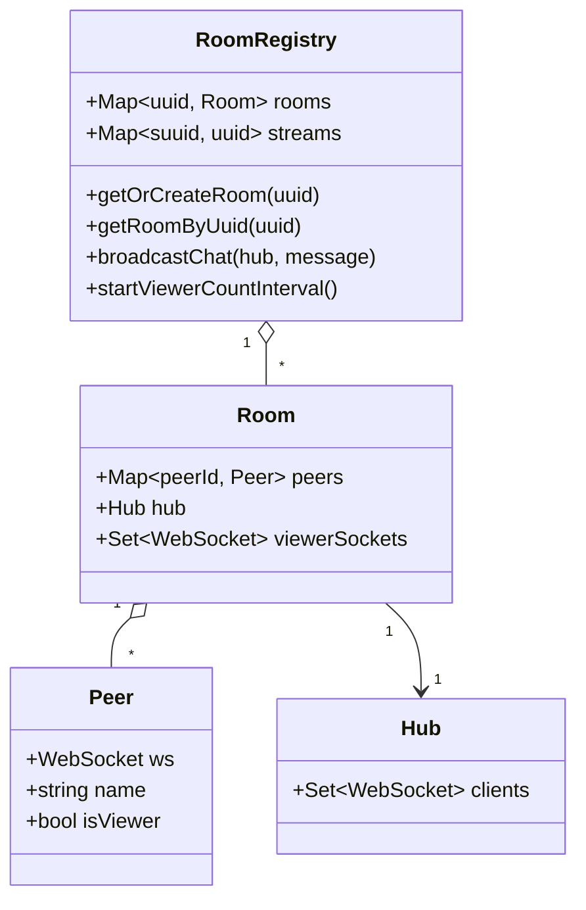
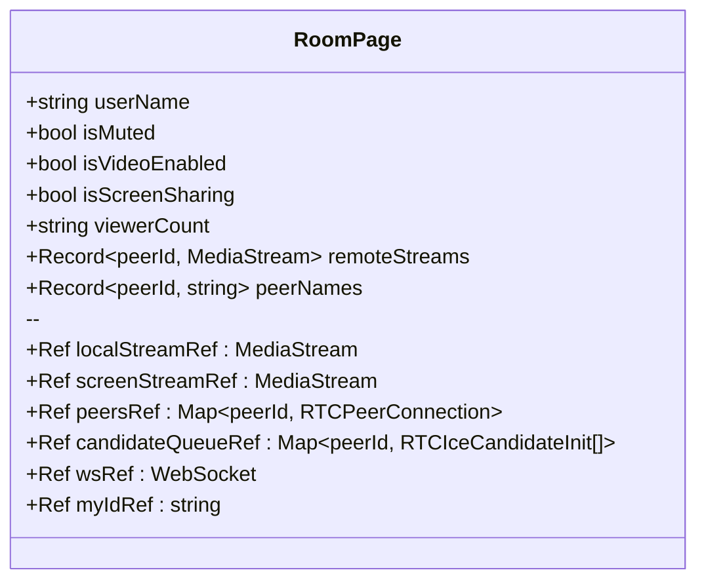
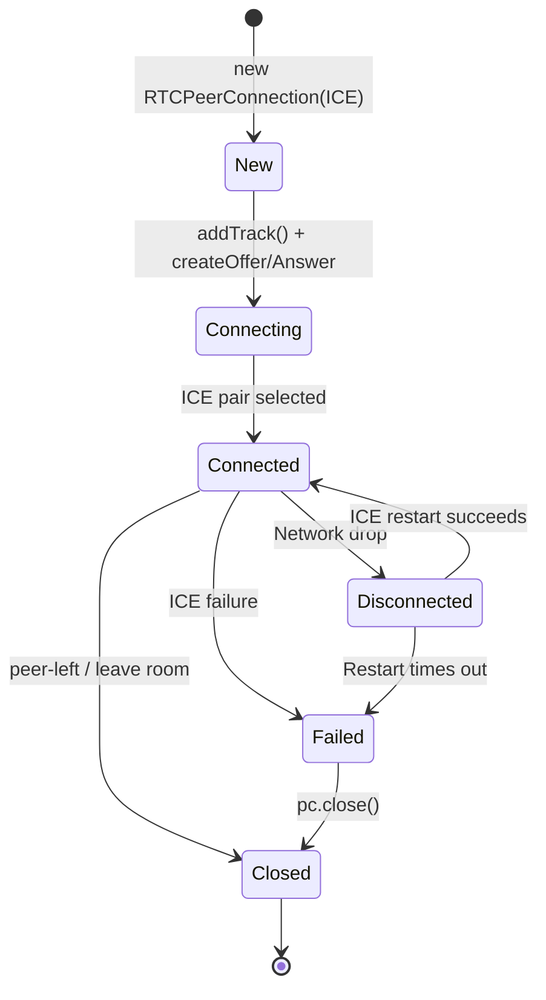

<div align="center">

# NexusRTC

**A real-time, peer-to-peer video conferencing platform built on WebRTC, Next.js 14, and a custom Node.js WebSocket signaling server.**

[](https://nextjs.org/)
[](https://react.dev/)
[](https://www.typescriptlang.org/)
[](https://webrtc.org/)
[](https://www.docker.com/)

</div>

---

## Table of Contents

- [Overview](#overview)
- [Features](#features)
- [Tech Stack](#tech-stack)
- [High-Level Architecture](#high-level-architecture)
- [Mesh Topology](#mesh-topology)
- [Project Structure](#project-structure)
- [Component Architecture](#component-architecture)
- [WebSocket Routes & Protocol](#websocket-routes--protocol)
- [Sequence Diagrams](#sequence-diagrams)
  - [Room Join + WebRTC Handshake](#room-join--webrtc-handshake)
  - [Chat Message Flow](#chat-message-flow)
  - [Viewer Count Flow](#viewer-count-flow)
  - [Screen Sharing Flow](#screen-sharing-flow)
  - [Peer Leaving Flow](#peer-leaving-flow)
- [State & Data Model](#state--data-model)
- [RTCPeerConnection Lifecycle](#rtcpeerconnection-lifecycle)
- [Prerequisites](#prerequisites)
- [Getting Started](#getting-started)
- [Environment Variables](#environment-variables)
- [Docker](#docker)
- [Production Deployment](#production-deployment)
- [Reverse Proxy (Nginx) Example](#reverse-proxy-nginx-example)
- [Browser Permissions & Compatibility](#browser-permissions--compatibility)
- [Troubleshooting](#troubleshooting)
- [Security Notes](#security-notes)
- [Roadmap](#roadmap)
- [Contributing](#contributing)
- [License](#license)

---

## Overview

**NexusRTC** lets you spin up a video call room in seconds — no sign-up, no accounts. Each participant connects directly to every other participant using **WebRTC mesh peer-to-peer connections**. A lightweight **WebSocket** signaling server (bundled with the Next.js app via a custom `server.js`) coordinates the initial handshake; after that, media flows directly between browsers.

The same Node.js process serves:

1. The Next.js UI (HTTP).
2. Three classes of WebSocket endpoints per room: **signaling**, **chat**, and **viewer count**.

---

## Features

### Video & Audio
- Multi-peer video calls (mesh topology).
- Mute/unmute microphone and camera.
- Low-latency peer-to-peer streams.
- 1280×720 @ 30fps capture with echo cancellation.

### Screen Sharing
- One-click screen share via `getDisplayMedia`.
- Up to 1920×1080 @ 30fps.
- Dynamic `RTCRtpSender.replaceTrack()` — no renegotiation needed.
- Automatic fallback to camera when sharing ends.

### Meeting Recording
- One-click record of the **entire meeting** — all participants composited into a single frame (like the gallery view).
- Uses `MediaRecorder` + an offscreen `<canvas>` for the composite stream.
- VP9 / WebM by default; server-side optional FFmpeg compression to H.264/AAC.
- Recordings uploaded to `/api/recordings` and saved under `public/recordings/`; client auto-downloads on stop.
- "X is recording this meeting" banner broadcast to all peers via signaling.

### Chat
- Real-time text chat over a dedicated WebSocket.
- Typing indicators (debounced, auto-clears after 3s).
- Emoji picker.
- Inline image sharing (drag/paste/upload, base64 data URLs).
- Unread badge when the chat panel is collapsed.

### UX
- Dark/light theme with system preference + localStorage persistence.
- Name modal before joining; name persisted in `localStorage`.
- Live viewer count badge (updated every ~1s).
- One-click "Copy link" to share rooms.
- Modern, responsive UI with CSS variables.

### Technical
- Mesh WebRTC topology — each peer ↔ every other peer.
- Google public STUN servers for NAT traversal.
- ICE candidate queuing before remote description is set.
- "Lowest ID offers" deterministic offer/answer roles to avoid glare.
- Auto-reconnect on WebSocket close (1s backoff).
- Custom HTTP + WebSocket server in a single Node process.

---

## Tech Stack

| Layer            | Technology                                                                   |
|------------------|------------------------------------------------------------------------------|
| UI Framework     | Next.js 14 (App Router), React 18, TypeScript 5                              |
| Styling          | Plain CSS with CSS variables (custom theme system)                           |
| Server           | Node.js HTTP server + `ws` WebSocket server (custom `server.js`)             |
| Realtime Signaling | WebSocket (offer/answer/candidate envelopes)                               |
| Media            | WebRTC (`RTCPeerConnection`, `getUserMedia`, `getDisplayMedia`)              |
| NAT Traversal    | Google STUN (`stun.l.google.com:19302`, `stun1.l.google.com:19302`)          |
| Packaging        | Docker (alpine-node20) + docker-compose                                      |
| State            | In-memory `Map<uuid, Room>` (no DB; volatile)                                |

---

## High-Level Architecture



**Key insight:** The server is **only** used for signaling, chat fan-out, and viewer-count broadcast. Once the WebRTC handshake completes, **media never traverses the server** — it goes peer-to-peer.

---

## Mesh Topology

In a mesh, every participant maintains an `RTCPeerConnection` to every other participant. For *N* peers, the room maintains *N × (N − 1) / 2* connections total.



> **Scaling caveat:** Mesh is simple and server-light but bandwidth/CPU on each client grows linearly with peer count. Practical sweet spot is **4–6 participants**. For larger rooms an SFU (e.g. mediasoup, LiveKit, Janus) would be the next step.

---

## Project Structure

```text
NexusRTC/
├── server.js                       # Custom HTTP + WebSocket server (entrypoint)
├── lib/
│   └── room-state.js               # In-memory room registry + chat hub + viewer broadcast
├── src/
│   ├── app/
│   │   ├── layout.tsx              # Root layout (fonts, ThemeProvider)
│   │   ├── page.tsx                # Landing / welcome page
│   │   ├── globals.css             # Theme variables + global styles
│   │   └── room/
│   │       ├── create/page.tsx     # Server component: redirects to /room/<new-uuid>
│   │       └── [uuid]/page.tsx     # Server component: renders <RoomPage />
│   └── components/
│       ├── RoomPage.tsx            # Main room: WebRTC, signaling, controls
│       ├── StreamPage.tsx          # Viewer-only stream variant (read-only consumer)
│       ├── Chat.tsx                # Chat panel (typing, emoji, image)
│       ├── ThemeProvider.tsx       # Applies theme attr on <html>
│       └── ThemeToggle.tsx         # Toggle dark/light theme
├── Dockerfile                      # node:20-alpine production image
├── docker-compose.yml              # Single-service compose file
├── next.config.js                  # reactStrictMode: true
├── tsconfig.json
├── package.json
└── README.md
```

---

## Component Architecture



### Module responsibilities

| File                                      | Responsibility                                                                                  |
|-------------------------------------------|-------------------------------------------------------------------------------------------------|
| `server.js`                               | Boots Next.js, attaches `ws` server, routes WS upgrades to `room` / `chat` / `viewer` handlers. |
| `lib/room-state.js`                       | `Map`-backed room registry, chat hub broadcast, periodic viewer-count tick (1s).                |
| `src/app/room/[uuid]/page.tsx`            | Server component — builds absolute room link, renders `<RoomPage />`.                           |
| `src/components/RoomPage.tsx`             | Client — `getUserMedia`, peer connections map, signaling state machine, UI controls.            |
| `src/components/Chat.tsx`                 | Client — chat WebSocket, typing debounce, emoji picker, image upload.                           |
| `src/components/ThemeProvider.tsx`        | Reads stored / system theme and writes `data-theme` on `<html>`.                                |

---

## WebSocket Routes & Protocol

The server exposes **three** WebSocket endpoints per room. All are upgraded on the same HTTP port (3000 by default).

| Endpoint                                  | Purpose                                                              |
|-------------------------------------------|----------------------------------------------------------------------|
| `/room/:uuid/websocket`                   | WebRTC signaling — name, peer discovery, offer/answer/ICE relay.     |
| `/room/:uuid/chat/websocket`              | Chat fan-out — text, typing indicators, images (base64 data URLs).   |
| `/room/:uuid/viewer/websocket`            | Server pushes the current peer count once per second.                |

### Signaling message envelopes

**Client → Server**

```jsonc
// First message after open — required before others see you
{ "event": "set-name", "name": "Alice" }

// Relayed to a specific peer
{ "to": "<peerId>", "event": "offer",     "data": "<RTCSessionDescription JSON>" }
{ "to": "<peerId>", "event": "answer",    "data": "<RTCSessionDescription JSON>" }
{ "to": "<peerId>", "event": "candidate", "data": "<RTCIceCandidate JSON>" }
```

**Server → Client**

```jsonc
// Sent once when you connect
{ "event": "joined",
  "peerId": "<your-id>",
  "peers": [ { "id": "<peerId>", "name": "Bob" }, ... ],
  "viewer": false }

// When someone else joins (after they send their name)
{ "event": "new-peer", "peerId": "...", "name": "Carol", "viewer": false }

// When a peer renames themselves
{ "event": "peer-name-updated", "peerId": "...", "name": "Carol The Great" }

// Relayed from another peer
{ "event": "offer" | "answer" | "candidate", "from": "<peerId>", "data": "..." }

// When a peer disconnects
{ "event": "peer-left", "peerId": "..." }
```

### Chat envelopes

```jsonc
// Text
{ "n": "Alice", "m": "hello!" }

// Typing
{ "type": "typing", "n": "Alice" }

// Image
{ "type": "image", "n": "Alice", "url": "data:image/png;base64,..." }
```

---

## Sequence Diagrams

### Room Join + WebRTC Handshake

Two clients connecting — Alice first, then Bob. Note the **"lowest ID offers"** rule that prevents both peers from sending offers simultaneously.

```mermaid
sequenceDiagram
  autonumber
  participant A as Alice (Browser)
  participant S as Signaling Server<br/>(/room/&lt;uuid&gt;/websocket)
  participant B as Bob (Browser)

  A->>A: getUserMedia()
  A->>S: WS Connect
  S-->>A: { event: "joined", peerId: A_id, peers: [] }
  A->>S: { event: "set-name", name: "Alice" }

  Note over B: Bob opens room link
  B->>B: getUserMedia()
  B->>S: WS Connect
  S-->>B: { event: "joined", peerId: B_id, peers: [{ id:A_id, name:"Alice" }] }
  B->>S: { event: "set-name", name: "Bob" }
  S-->>A: { event: "new-peer", peerId: B_id, name: "Bob" }

  Note over A,B: Each peer decides who offers:<br/>"myId &lt; peerId" → I offer
  alt A_id &lt; B_id
    A->>A: pc = new RTCPeerConnection(ICE)
    A->>A: addTrack(localStream)
    A->>A: createOffer + setLocalDescription
    A->>S: { to: B_id, event: "offer", data: SDP }
    S-->>B: { from: A_id, event: "offer", data: SDP }
    B->>B: pc = new RTCPeerConnection(ICE)
    B->>B: addTrack(localStream)
    B->>B: setRemoteDescription(offer)
    B->>B: createAnswer + setLocalDescription
    B->>S: { to: A_id, event: "answer", data: SDP }
    S-->>A: { from: B_id, event: "answer", data: SDP }
    A->>A: setRemoteDescription(answer)
  end

  par ICE candidate trickle
    A->>S: { to: B_id, event: "candidate", data: ICE }
    S-->>B: { from: A_id, event: "candidate", data: ICE }
    B->>B: addIceCandidate (queue if remoteDescription not set yet)
  and
    B->>S: { to: A_id, event: "candidate", data: ICE }
    S-->>A: { from: B_id, event: "candidate", data: ICE }
    A->>A: addIceCandidate
  end

  Note over A,B: Direct P2P media flowing<br/>(SRTP via STUN-resolved addresses)
  A-->>B: Audio + Video (P2P)
  B-->>A: Audio + Video (P2P)
```

### Chat Message Flow

```mermaid
sequenceDiagram
  autonumber
  participant A as Alice
  participant H as Chat Hub<br/>(/room/&lt;uuid&gt;/chat/websocket)
  participant B as Bob
  participant C as Carol

  A->>A: User types → debounce 500ms
  A->>H: { type: "typing", n: "Alice" }
  H-->>B: { type: "typing", n: "Alice" }
  H-->>C: { type: "typing", n: "Alice" }
  Note over B,C: Show "Alice is typing..."<br/>auto-clear in 3s

  A->>H: { n: "Alice", m: "hello team" }
  H-->>A: (echo) { n: "Alice", m: "hello team" }
  H-->>B: { n: "Alice", m: "hello team" }
  H-->>C: { n: "Alice", m: "hello team" }
```

> **Note:** The chat hub is a simple **broadcast-to-all-in-room** model. Images are sent as **base64 data URLs** inline — fine for small images, but be careful with very large files in production.

### Viewer Count Flow

```mermaid
sequenceDiagram
  participant Server as server.js
  participant State as room-state.js
  participant Client as Browser

  Note over Server: On boot:<br/>startViewerCountInterval()
  loop Every 1 second
    State->>State: For each room: count = room.peers.size
    State-->>Client: send(count) via /room/&lt;uuid&gt;/viewer/websocket
  end
  Client->>Client: setViewerCount(count) → re-render badge
```

### Screen Sharing Flow

Screen share uses **`replaceTrack()`** — no renegotiation needed, so peers see the new video instantly.



### Peer Leaving Flow

```mermaid
sequenceDiagram
  participant A as Alice
  participant S as Server
  participant B as Bob

  A->>S: WS close (tab closed / navigation)
  S->>S: room.peers.delete(A_id)
  S-->>B: { event: "peer-left", peerId: A_id }
  B->>B: pc.close(); peersRef.delete(A_id)
  B->>B: setRemoteStreams → remove A_id
  B->>B: setPeerNames → remove A_id
  Note over B: Alice's tile disappears from grid
```

---

## State & Data Model

### Server-side (in-memory)



### Client-side (RoomPage refs/state)



---

## RTCPeerConnection Lifecycle



The client also maintains a **candidate queue** so ICE candidates arriving before `setRemoteDescription` are buffered and flushed once the description is applied.

---

## Prerequisites

- **Node.js 18+** (LTS recommended; the Docker image uses Node 20).
- **npm** (the project uses `--legacy-peer-deps` because of the Next 14 / React 18 peer matrix).
- **FFmpeg** *(optional)* — for server-side recording compression. If unavailable, recordings stay as raw `.webm`.
- A modern browser with WebRTC: Chrome / Edge 90+, Firefox 88+, Safari 14+, Opera 76+.
- For internet deployments: **HTTPS** (browsers require a secure context for `getUserMedia` / `getDisplayMedia` on non-localhost origins).

---

## Getting Started

```bash
# 1. Clone
git clone https://github.com/subhm2004/NexusRTC.git
cd NexusRTC

# 2. Install (legacy peer deps to satisfy Next 14 / React 18)
npm install --legacy-peer-deps

# 3. Run in dev mode (Next dev + WS on the same port)
npm run dev
```

Open **http://localhost:3000**.

### Available scripts

| Script              | What it does                                                   |
|---------------------|----------------------------------------------------------------|
| `npm run dev`       | Starts `node server.js` in dev mode (HMR via Next).            |
| `npm run build`     | Runs `next build` to produce a production `.next` bundle.      |
| `npm run start`     | Runs `node server.js` with `NODE_ENV=production`.              |
| `npm run lint`      | Runs `next lint`.                                              |
| `npm run clean`     | Removes `.next/`.                                              |
| `npm run reinstall` | Wipes `.next`, `node_modules`, lockfile and reinstalls.        |

---

## Environment Variables

| Variable    | Default       | Purpose                                |
|-------------|---------------|----------------------------------------|
| `PORT`      | `3000`        | HTTP + WebSocket listen port.          |
| `NODE_ENV`  | `development` | `production` enables Next prod mode.   |

---

## Docker

### Compose (recommended)

```bash
docker compose up --build           # Foreground
docker compose up -d --build        # Detached
docker compose down                 # Stop
```

### Plain Docker

```bash
docker build -t nexus-rtc .
docker run -p 3000:3000 nexus-rtc

docker run -e PORT=8080 -p 8080:8080 nexus-rtc
```

The Dockerfile is small and straightforward:

```Dockerfile
FROM node:20-alpine
WORKDIR /app
COPY package*.json ./
RUN npm install --legacy-peer-deps
COPY . .
RUN npm run build
ENV NODE_ENV=production
ENV PORT=3000
EXPOSE 3000
CMD ["node", "server.js"]
```

---

## Production Deployment

NexusRTC is a **single Node process** that serves both HTTP and WebSocket on the same port. That means deployment is straightforward, but you must pick a platform that supports **WebSockets** and ideally **HTTPS termination**.

### Suitable platforms

| Platform                       | Notes                                                                |
|--------------------------------|----------------------------------------------------------------------|
| VPS / EC2 / DigitalOcean Droplet | Most flexible. Put Nginx in front for TLS.                         |
| Railway / Render / Fly.io      | First-class WebSocket support; just deploy the Docker image.         |
| DigitalOcean App Platform      | Works; ensure WebSocket health checks are enabled.                   |
| Heroku / Containers            | Works; remember sticky session not required (single instance only).  |
| **Vercel (serverless)**        | **Not supported** — needs a long-running WS process.                 |

### Single-instance constraint

State is in-memory (`Map` in `lib/room-state.js`). **Do not run multiple replicas** without adding a shared signaling backplane (Redis pub/sub, NATS, etc.) — peers in the same room must hit the same process.

### Production checklist

- [ ] Use **HTTPS** (browsers won't grant camera/mic on plain HTTP outside localhost).
- [ ] Set `PORT` and `NODE_ENV=production`.
- [ ] Put Nginx/Caddy/Cloudflare in front for TLS and HTTP/2.
- [ ] Forward the `Upgrade` and `Connection` headers for WebSockets.
- [ ] (Optional) Add your own TURN server (`coturn`) for clients behind symmetric NATs / corporate firewalls.

---

## Reverse Proxy (Nginx) Example

```nginx
upstream nexus {
  server 127.0.0.1:3000;
}

server {
  listen 443 ssl http2;
  server_name calls.example.com;

  ssl_certificate     /etc/letsencrypt/live/calls.example.com/fullchain.pem;
  ssl_certificate_key /etc/letsencrypt/live/calls.example.com/privkey.pem;

  location / {
    proxy_pass http://nexus;
    proxy_http_version 1.1;
    proxy_set_header Host $host;
    proxy_set_header X-Forwarded-For   $proxy_add_x_forwarded_for;
    proxy_set_header X-Forwarded-Proto $scheme;

    # WebSocket upgrade
    proxy_set_header Upgrade    $http_upgrade;
    proxy_set_header Connection "upgrade";

    # Long-lived WS connections
    proxy_read_timeout 3600s;
    proxy_send_timeout 3600s;
  }
}
```

### Caddy alternative

```caddy
calls.example.com {
  reverse_proxy localhost:3000
}
```

Caddy automatically issues a Let's Encrypt cert and proxies WebSockets — no extra config needed.

---

## Browser Permissions & Compatibility

NexusRTC requests:

- **Camera** (`getUserMedia`) — for outgoing video.
- **Microphone** (`getUserMedia`) — for outgoing audio.
- **Display** (`getDisplayMedia`) — only when the user clicks "Share screen".

| Browser            | Min Version | Notes                                                |
|--------------------|-------------|------------------------------------------------------|
| Chrome / Chromium  | 90+         | Best support, all features.                          |
| Edge (Chromium)    | 90+         | Same as Chrome.                                      |
| Firefox            | 88+         | Full support.                                        |
| Safari             | 14+         | Works; some codec quirks on older iOS.               |
| Opera              | 76+         | Chromium-based — works.                              |

> **iOS Safari:** Only one tab can hold the camera at a time. Background tabs may pause media. Use a recent iOS version.

---

## Troubleshooting

| Symptom                                           | Likely Cause / Fix                                                                                              |
|---------------------------------------------------|-----------------------------------------------------------------------------------------------------------------|
| "Camera and microphone permissions are needed"    | Browser denied permission, or origin isn't HTTPS (or localhost). Reset site permissions and reload.            |
| You see your own tile but not the other peer      | Either the WS isn't connected (firewall blocking WS?) or ICE failed (NAT/firewall — add a TURN server).         |
| Audio works but no video                          | The other peer's camera is disabled, or a video track was replaced mid-flight. Check the browser console logs. |
| Screen share doesn't appear on remote side        | Confirm both peers reached `connectionstate: connected` before sharing. The code retries `replaceTrack` at 500ms and 2000ms. |
| "Connection closed. Please refresh the page."     | The signaling WS dropped and auto-reconnect couldn't recover. Reload to re-establish.                           |
| Chat works but video doesn't                      | Chat uses a separate WS endpoint. Signaling WS (`/room/<uuid>/websocket`) may be blocked separately.            |
| Behind a corporate firewall, nothing connects     | STUN alone isn't enough. Deploy a TURN server (e.g. `coturn`) and add it to the `ICE.iceServers` array in `RoomPage.tsx`. |

### Adding a TURN server

Edit `src/components/RoomPage.tsx`:

```ts
const ICE = {
  iceServers: [
    { urls: "stun:stun.l.google.com:19302" },
    {
      urls: "turn:turn.example.com:3478",
      username: "youruser",
      credential: "yourpass",
    },
  ],
};
```

---

## Security Notes

- **Authentication:** There is **none**. Anyone with the room URL can join. Treat the UUID as a shared secret.
- **End-to-end encryption:** WebRTC media is encrypted via SRTP between peers. The signaling server never sees media. However, the chat WebSocket is **not E2E encrypted** — messages pass through the server in plaintext (over TLS if you terminate with HTTPS).
- **Name spoofing:** Users pick their own display name; the server doesn't verify identity.
- **DoS surface:** In-memory `Map`s grow unbounded with rooms. For public deployments consider adding rate limits, room TTLs, and a max-peers cap.
- **Data URLs in chat:** Images are sent as base64 inline; a malicious client could spam very large payloads. Add server-side size limits before going public.

---

## Roadmap

- [ ] TURN server bundled in `docker-compose.yml` (coturn).
- [ ] Optional room passwords / shareable join tokens.
- [ ] SFU mode for rooms > 6 peers (mediasoup or LiveKit adapter).
- [ ] Persistent chat history (Redis/SQLite) with TTL.
- [ ] Recording (server-side via headless Chromium).
- [ ] Mobile PWA install prompts.
- [ ] Background blur / virtual backgrounds (MediaPipe).
- [ ] End-to-end encrypted chat (Web Crypto + per-room shared key).

---

## Contributing

Contributions are welcome. The codebase is intentionally small — read `server.js`, `lib/room-state.js`, and `src/components/RoomPage.tsx` to understand the whole signaling pipeline in one afternoon.

```bash
git checkout -b feat/your-feature
# make changes
npm run lint
git commit -m "feat: ..."
```

Open a PR with a clear description of the change and any screenshots/recordings.

---

## License

Open source — feel free to use, fork, and adapt. If you ship a commercial product on top of NexusRTC, a star on the repo is appreciated.

---

<div align="center">

**Built with Next.js, React, and WebRTC**

</div>
